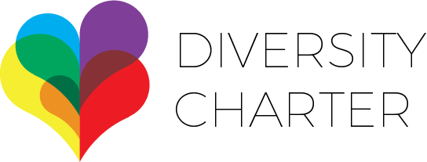

# Statement on Diversity and Inclusion at Tech Events

August 2021

Diversity and inclusion in the technology industry are subjects that are close to the heart of the Open Web Docs team. We value fostering a diverse and inclusive technology industry because it is the right thing to do. If that isn’t a strong enough argument, having a diverse team and diverse representatives has proven again and again to create better products, foster a better work environment and, if you need the business case, to improve the bottom line.

Tech events are a highly visible face of the tech industry. Not only are the speakers representatives of their respective companies and technologies, but they will act as role models for attendees and external audiences. It is therefore vital that speaker lineups represent the diverse range of people who work in technology and that events foster an inclusive and welcoming experience for all of their potential attendees, no matter their gender, ethnicity, sexual orientation, religion, national origin, disability or any other factor. Any organization that participates in tech events needs to pay attention to these issues and work to make these events more diverse and more welcoming.

That is why we have signed up to support the [Diversity 
Charter](https://diversitycharter.org) for technology events.

As part of our commitment, we will support diversity & inclusion in the following ways when it comes to events:

- Our team will not take part in panel discussions of two or more people unless there is at least one person of an underrepresented group on the panel, not including the chair.

- We will not speak at or sponsor an event unless the event’s organizers are clearly working hard to address the diversity of their speakers and attendees. We expect representation from different genders, ethnicities, abilities and other underrepresented groups in tech.

- We will not participate in or sponsor events unless they operate under, and enforce, a published code of conduct. We also developed [our own code of conduct](code_of_conduct.md) adapted from the Contributor Covenant. We like codes of conduct that are specific and provide detailed enforcement information.

- We encourage, and will always use, inclusive language at events and in online communities surrounding events. This includes, but is not limited to, discouraging the use of [gendered](https://writingcenter.unc.edu/tips-and-tools/gender-inclusive-language/) or [ableist](https://www.autistichoya.com/p/ableist-words-and-terms-to-avoid.html) language.

- We will offer, and encourage other event organizers to offer, free or discounted diversity tickets for underrepresented groups in the technology industry, and where necessary, financial help towards travel or accommodation.

We’ll also hold ourselves to the same standards where our team is the host, for internal and public events as well. There will be times when event organizers are unable to meet the above rules, especially with smaller scale events or meetups, as and when these occur we will take them on a case by case basis and are happy to discuss the guidelines with organizers and attendees alike.

We also will support and encourage the development of events that cater to specific underrepresented groups as a way to foster inclusion and diversity in our industry. 

This statement adopted from [Samsung Internet's Diversity & Inclusion Statement](https://developer.samsung.com/internet/diversity-inclusion.html) published under a [Creative Commons Attribution-ShareAlike license](https://creativecommons.org/licenses/by-sa/4.0/).