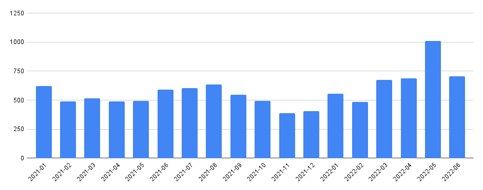
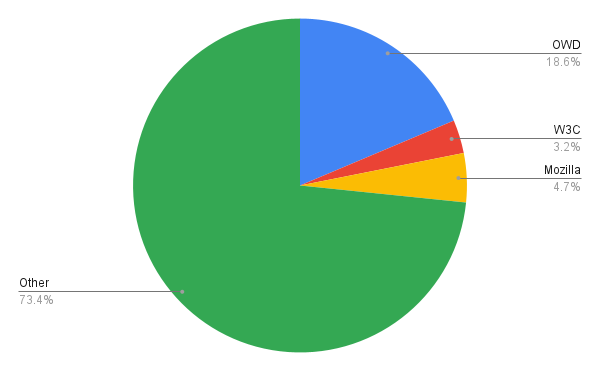
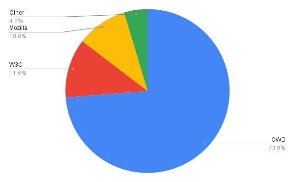
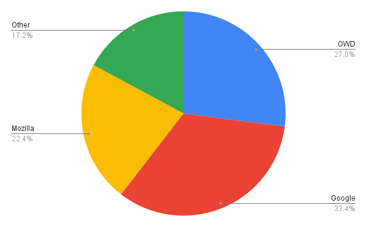
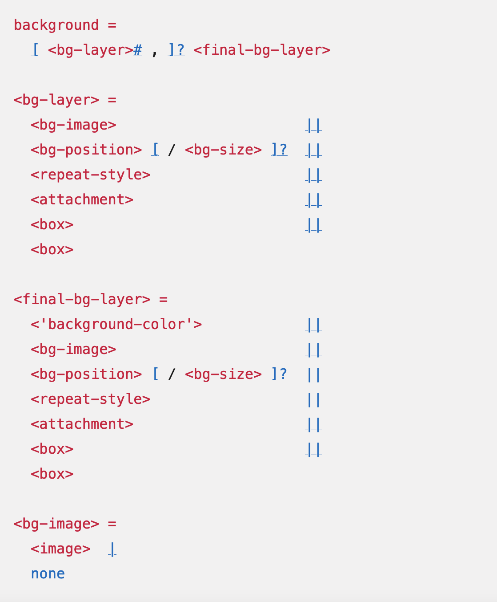

# Open Web Docs Q2 2022 Impact Report

This report provides an update on Open Web Docs for the second quarter of 2022. It’s split into the following parts:

1. **Goals**: a restatement of the overall goals of the organization
2. **Impact**: a summary of day to day contributions to documentation projects.
3. **Projects**: a summary of completed projects
4. **Community**: activities in which OWD staff have mentored volunteers on docs projects

## Goals

The main focus of Open Web Docs in 2022 has been contributing to MDN Web Docs.

This takes the form of contributions to the main content repositories under the [https://github.com/mdn](https://github.com/mdn) GitHub organization:

* [https://github.com/mdn/content](https://github.com/mdn) : the main content repository for MDN Web Docs
* [https://github.com/mdn/browser-compat-data](https://github.com/mdn) : the source of browser compatibility data
* [https://github.com/mdn/learning-area](https://github.com/mdn) : examples supporting the MDN Learning Area
* [https://github.com/mdn/interactive-examples](https://github.com/mdn) : source for MDN’s interactive examples

## Impact

### The value of MDN

MDN is an essential resource for web developers. It:

* [has been linked from Stack Overflow more than 150,000 times in the last 5 years](https://meta.stackoverflow.com/questions/417189/which-sites-are-currently-linked-to-most-often-in-stack-overflow/417190#417190), #2 among all developer documentation sites
* was ranked #2 (behind Stack Overflow) in the [State of JS 2021](https://2021.stateofjs.com/en-US/resources/#sites_courses) and [State of CSS 2021](https://2021.stateofcss.com/en-US/resources/#sites_courses) surveys

The main MDN repositories, especially mdn/content, are extremely active. In Q2 2022, 2475 PRs were merged into mdn/content from 507 different users.

It is therefore essential for the web developer community that the MDN core team continues to:

* contribute to MDN to maintain and improve it
* review PRs from the contributor community.

### The contribution of Open Web Docs

On a daily basis, the Open Web Docs staff team contributes to the open-source repositories of the MDN Web Docs GitHub organization. The contributions can come in many forms (creating pull requests, filing issues, reviewing pull requests, participating in discussions, triaging issues) on a handful of repositories that are foundational to MDN Web Docs.

In this section we’ll see that Open Web Docs is the most significant organization contributing to MDN content maintenance.

We’ll present metrics for the two busiest repositories on the MDN organization:

* **mdn/content**, which contains the source for MDN’s pages
* **mdn/browser-compat-data**, which contains compatibility data used to power compatibility tables on MDN and other tools including caniuse.com, IntelliJ WebStorm and Visual Studio Code

For each repository we’ll present two metrics:

* **The number of PRs merged to that repository in the quarter.**
* **The number of reviews performed on each merged PR to that repository in the quarter.**

For both these metrics, we’ll not just include numbers for OWD, but also for the other organizations that help maintain the repository, and for volunteer contributors.

#### mdn/content

This is the main repository under the MDN organization on GitHub and is extremely active, receiving 500-700 pull requests every month, from about 200 distinct contributors. The chart below shows the total number of PRs merged to mdn/content each month since the start of 2021:

The spike in May 2022 is from the Writing Day, which is described below under “Community”.

Here we’ve split contributions into the following groups:

* OWD staff
* W3C staff (this is actually just Mike Smith)
* Mozilla staff
* Other (mostly volunteers, but also people paid by other organizations to work on MDN)

Note that [@queengooborg](https://github.com/queengooborg) works for both OWD and Mozilla, so we have simply split her contributions between each organization.

##### PRs merged to mdn/content

All merged PRs: 2475.

| OWD     | W3C    | Mozilla | Other |
|---------|--------|---------|-------|
| 461.5   | 80     | 117.5   | 1816  |

This shows that OWD is the biggest single organization contributing to mdn/content, as measured by PR volume. It also shows that mdn/content gets a huge volume of contributions from volunteers: 73.4% of PRs in Q2 were “Other”, which is mostly volunteers.

##### Reviews on merged PRs to mdn/content

All reviews: 2872

| OWD     | W3C    | Mozilla | Other |
|---------|--------|---------|-------|
| 2118.5  | 334    | 2867.5  | 133   |

This shows also shows that 73.8% of all PR reviews to mdn/content in Q2 were made by OWD staff. We should especially note Jean-Yves Perrier here, who made 1333 PR reviews in this quarter!

#### mdn/browser-compat-data

This is the second-busiest repository in the MDN organization on GitHub. It contains machine-readable JSON files that describe browser support for web platform features. This data is used not only in MDN but also by other sites like caniuse.com.

For this repository we’ve split contributions into four groups:

* OWD staff
* Google staff
* Mozilla staff
* Other (mostly volunteers, but also people paid by other organizations to work on MDN) 

Note that for browser-compat-data we have not included W3C, as they are not a major contributor to this repository. Instead we have included Google who are a significant contributor.

Note that [@queengooborg](https://github.com/queengooborg) works for both OWD and Mozilla, so as before, we have simply split her contributions between each organization.

##### PRs merged to mdn/browser-compat-data

All merged PRs: 778

| OWD    | Google | Mozilla | Other |
|--------|--------|---------|-------|
| 239.5  | 58     | 259.5   | 221   |

##### Reviews on merged PRs to mdn/browser-compat-data

All reviews: 688

| OWD  | Google | Mozilla | Other |
|------|--------|---------|-------|
| 186  | 230    | 154     | 118   |

This shows that OWD is a substantial contributor to browser-compat-data. It’s worth mentioning though that by far the biggest contributor to this repo, by both commit count and review count, was [@queengooborg](https://github.com/queengooborg).

## Projects

In the second quarter of 2022 we completed the projects listed below.

### Web/API page types

[See the project proposal.](https://github.com/openwebdocs/project/issues/91)

In Q2 we started a project to classify MDN reference pages and represent the classification in a machine-readable way. This is a piece of infrastructure work that will enable us to have more consistent and correct reference documentation.

For example, we need to:

* Define the type of sidebar that a page ought to have
* Define the organization of a reference page, including the page elements that should appear (such as spec URLs or BCD tables) and the order in which they should appear
* Define the format that page titles should have.

All these features depend on reliably identifying the kind of thing that a page documents. Up to now we have used page tags for this, but their semantics isn’t precisely defined and (partly as a result of this) the tags are often incorrectly applied.

So we decided to define a dedicated front matter item to represent the page type, across all our most important docs.

In Q2 we completed this project for the Web/API docs, which represent about half the total number of pages on MDN. We defined 12 page types that exist in the Web/API docs and added the correct front matter key to all 6000 Web/API pages.

The most immediate impact of this is that we will be able to fix the titles of Web/API pages on MDN, as discussed in [https://github.com/mdn/content/discussions/5121](https://github.com/mdn/content/discussions/5121) and also requested in [https://github.com/openwebdocs/project/issues/104](https://github.com/openwebdocs/project/issues/104) . We hope that this will be a Q3 project.

### Better CSS formal syntax

MDN’s reference pages for CSS properties include a section which contains the formal syntax for the property. This is potentially a very useful part of the page, giving a concise and precise definition of the property’s syntax.

However, it’s long been problematic.

First, the way it is formatted makes it very hard to read. For example, here’s part of the syntax for <code>[background](https://developer.mozilla.org/en-US/docs/Web/CSS/background)</code>:

Second, although the formal syntax should match the syntax in the specifications, we generated formal syntax in MDN from a separate repository, mdn/data. We often weren’t able to keep this up to date with the specification, and as a result, users of MDN would see inaccurate or outdated syntax.

In this project we’ve tackled both of these problems.

First, we’ve used the [css-tree](https://www.npmjs.com/package/css-tree) package to parse formal syntax definitions into an AST, which makes it much easier to render it in a more usable form. In particular, we have added syntax highlighting and pretty-printing. Here’s that syntax for `background` with the updated code:

Second, we’ve used the W3C’s [webref/css](https://www.npmjs.com/package/@webref/css) package to supply the formal syntax. This package scrapes formal syntax directly from the specifications, so we can be confident that it will always match the version in the specs.

The webref package contains lots of interesting structured content extracted from the specs, and we think there’s potentially a big role to play for webref in making MDN more accurate and maintainable. Using it for formal syntax is, we hope, only the start.

Thanks especially go to @lahmatiy, the developer of css-tree, and @tidoust for his work on webref and his invaluable guidance in navigating the CSS specifications.

### Cascade Layers

Cascade Layers, which allows developers to define contained layers of specificity, recently landed in all browsers. While “cascade” is the C in CSS, many developers don’t understand the cascade or how specificity, cascade, and inheritance work. So much so, that specificity is the top CSS page.

This quarter we rewrote existing documentation, including a full re-write of [Introducing the CSS Cascade](https://developer.mozilla.org/en-US/docs/Web/CSS/Cascade) and [Specificity](https://developer.mozilla.org/en-US/docs/Web/CSS/Specificity) (the most visited CSS page), including creating new [!important ](https://developer.mozilla.org/en-US/docs/Web/CSS/important)documentation and adding layers to mentions of cascade, @import, etc., and switching how specificity weight is defined throughout MDN documentation.  

## Community

One of our goals is to collaborate with and mentor volunteers in contributing to open source documentation. In this section we’ll describe some of these collaborative projects.

### Write the Docs Writing Day

In May we hosted a table at the Writing Day for the Write the Docs Portland conference. We were joined by about 20 volunteers, many of whom were quite new to Git and GitHub. We introduced MDN Web Docs and explained how people could contribute using the GitHub UI. Our focus was to replace usages of `var` in MDN’s JavaScript documentation with `let` or `const`. During the day our volunteers filed PRs cleaning `var` from about 250 pages in the JavaScript documentation, out of about 300 pages in which it  appeared. For many of the volunteers this was a first contribution using GitHub.

There are more details in our blog post: [https://opencollective.com/open-web-docs/updates/write-the-docs-writing-day](https://opencollective.com/open-web-docs/updates/write-the-docs-writing-day) .

### Cleaning var from Web/API

After Writing Day we started a community project to remove `var` from the Web/API documentation. We filed a tracking bug: [https://github.com/mdn/content/issues/16662](https://github.com/mdn/content/issues/16662) to coordinate the work. We’ve provided ongoing review and mentoring for volunteers, who in Q2 have removed `var` from almost 500 pages in Web/API.
